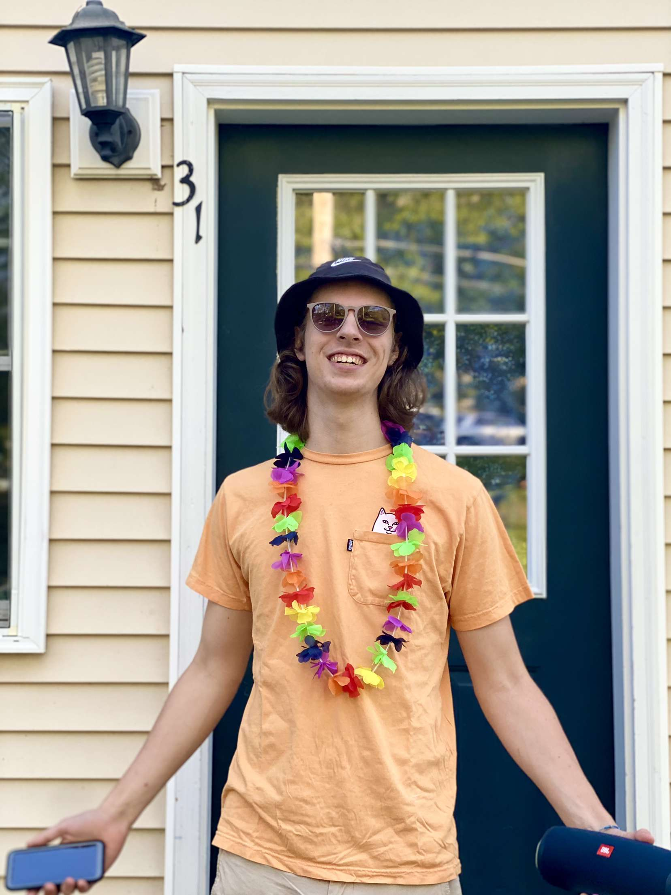

# workoutapp
Workout app for Web Programming

# About me
My name is Mitch Chappell, I am a part of the college’s swim team and have been coding since I was in 10th grade. 
I first learned java and made a small side scroller game for a high school class. 
Since my first day of learning Java, I have enjoyed coding and often do it on my free time.
My freshman year I was a Computer Engineering major, I switched to computer science sophomore year to dive deeper into coding.
Now being a 4th year in college I have used and learned a few different languages, including python, html, CSS, JavaScript, C, C++, and C#. 
I have been able to narrow down the broad term of programmer and decided I want to create a career in the web development field. 
In the past year I have been learning front end development, using mainly Vue, Bulma/Buefy, and CSS. I am currently hosting two sites. 
Both are a work in progress and hopefully after this class I can rewrite them and finish them. Sagehaps.com is going to be a social media for cats. 
The other is my resume site, I currently don’t have a domain for it but it can be viewed at https://cocky-volhard-784d38.netlify.app

# Goal for the semster
In this class I want to learn how to make professional code so I can go into the “real world” with the skills needed to succeed. I worked an internship which exposed me to professional code and am hoping this class provides the guidance I feel I need to create my own professional level programs. 

# Me

